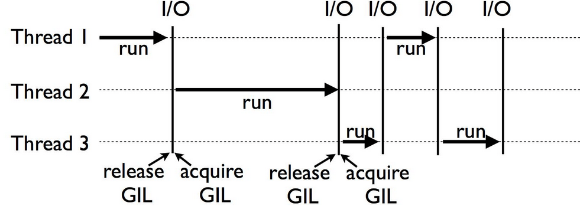

# 병렬(병행)프로그래밍 학습 중요성

결론부터 말하자면 프로그래밍 작업은 운영체제에 대한 지식과 실행흐름에 대한 이해를 바탕으로 진행되어야 양질의 결과물이 나오기 때문임.

특히 백엔드 쪽에서 스레드, 스케줄러 부하가 큰 작업을 다룰 때 (ex.인터넷 뱅킹, 증시 현황)에는 해당 지식이 더더욱 절실해짐. 

## 프로세스 vs 스레드 차이

### 프로세스 
- 운영체제에서 할당받는 최소한의 자원 단위를 뜻함. 
- CPU 동작 시간, 주소 공간이 서로 독립적임.
- Code,Data,Stack,Heap 각 메모리 영역들이 서로 독립적임.
- 최소 1개의 메인 스레드를 보유함. 
- 메모리가 서로 독립적이지만, 파이프, 파일, 소켓 등의 기술들로 프로세스 간 통신 가능 (그런데 비용이 큼) 전문용어로 Context Switching이라고 함

### 스레드 
- 프로세스 내의 실행 흐름 단위임. 
- 그러니 당연히 프로세스 내의 자원을 사용함.
- Stack만 별도로 사용하고, 나머지 메모리 영역(Code, Data, Heap)은 자기들끼리 공유함. (변수 공유)
- 한 스레드의 결과가 다른 스레드에게 영향을 미침.
    - 그래서 동기화 문제는 정말로 주의해야함. (디버깅이 힘듦.)

### 멀티 스레드 
- 한 개의 단일 어플리케이션에서 여러 스레드로 구성 후 작업을 처리하는 것
- 그러니 시스템 자원이 덜 소모됨 (효율성, 처리량 증가)
    - 하지만 어떻게 짜느냐에 따라 프로세스 여러 개 돌리는 것보다 더 못할 수도 있음
- 통신부담 감소, 디버깅은 어려워짐, 단일 프로세스에는 효과가 미약할 수 있음. (요새는 CPU 성능이 좋아서), 자원 공유 문제가 생길 수 있음(교착 상태), 프로세스 영향 끼침

### 멀티 프로세스 
- 한 개의 단일 어플리케이션에서 여러 프로세스로 구성 후 작업을 처리하는 것
- 한 개의 프로세스에서 문제 발생 시 확산은 없음. 한 놈만 kill -9 하면 되니깐 
- 캐시 체인지를 활용하며, Cost 비용이 매우 높음 (오버헤드 상승 가능성), 복잡한 통신 방식 사용 


## GIL (Global Interpreter Lock)
- 우리가 가장 자주 쓰는 기본적인 파이썬 인터프리터를 CPython이라고 함.
- 이 CPython 인터프리터가 우리가 쓴 파이썬 코드를 byte code로 바꿔서 실행 시킴.
- 이 과정에서 여러 개의 스레드를 사용할 경우 '단 하나'의 스레드만 객체에 접근할 수 있게 제한해놨음. 이걸 GIL이라고 함.



### Q. 이딴 거 왜 만듦?? 그럼 병렬처리는 어떻게 함?
1. CPython은 객체 참조를 사용해서 메모리를 관리하는데 스레드를 여러 개 운용하면 오류나 충돌이 일어나기 쉬운 구조라서 그럼. (Thread-Safe 문제)
2. 단일 스레드 써도 충분히 빠름 
3. 멀티 프로세스 써도 GIL 바깥 영역에서 효율적인 코딩 가능함.
4. 병렬 처리는 Multiprocessing, asyncio 등 선택지 다양함.
5. thread 동시성 구현을 위해서 Jython, IronPython 등 다른 인터프리터들도 사용 가능함. 

### Q. 어? 그럼 저번에 내가 썼던 threading 모듈은 뭐였지?
1. threading은 OS 스레드를 생성함.
- 내부적으로는 C 언어의 pthread (POSIX thread)나 Windows 스레드를 사용해서 실제 OS 수준의 스레드를 만듦.
- 그러니까 멀티스레드인거는 맞다! 하지만...

2. CPython의 GIL이 모든 스레드의 실행을 순차화함.
- 한 순간에 하나의 스레드만 바이트코드를 실행할 수 있게 함.

3. 스레드는 *짧은 시간마다 GIL을 양보(switch)* 하면서 돌아가게 됨. (보통 5ms 단위).
- 그러니 엄밀히 말하자면 이게 병렬 실행같아 보여도 ㄹㅇ 진짜 병렬은 아닌거임.

---

## 실습 
```python
import logging
import threading
import time

def thread_func(name):
    logging.info("Sub-Thread: %s: Starting", name)
    time.sleep(3)
    logging.info("Sub-Thread: %s: Finishing", name)


if __name__ == "__main__":
    # Logging 포맷 설정하기 
    format = "%(asctime)s: %(message)s"
    logging.basicConfig(format=format, level=logging.INFO, datefmt="%H:%M:%S")
    logging.info("Main-Thread: before creating Thread")

    # 함수 인자 확인
    x = threading.Thread(target=thread_func, args=("First", ))

    logging.info("Main-Thread: before running Thread")

    x.start()

    logging.info("Main-Thread: Waiting For the Thread To Finish.")

    logging.info("Main-Thread: Now All Finished!")

```

```
21:54:28: Main-Thread: before creating Thread
21:54:28: Main-Thread: before running Thread
21:54:28: Sub-Thread: First: Starting
21:54:28: Main-Thread: Waiting For the Thread To Finish.
21:54:28: Main-Thread: Now All Finished!
21:54:31: Sub-Thread: First: Finishing
```

요점은 부모 스레드가 먼저 끝나도 자식 스레드는 끝까지 맡은 일을 다 하고 종료된다는 거임.

그런데 thread join()을 사용하면

```python
import logging
import threading
import time

def thread_func(name):
    logging.info("Sub-Thread: %s: Starting", name)
    time.sleep(3)
    logging.info("Sub-Thread: %s: Finishing", name)


if __name__ == "__main__":
    # Logging 포맷 설정하기 
    format = "%(asctime)s: %(message)s"
    logging.basicConfig(format=format, level=logging.INFO, datefmt="%H:%M:%S")
    logging.info("Main-Thread: before creating Thread")

    # 함수 인자 확인
    x = threading.Thread(target=thread_func, args=("First", ))

    logging.info("Main-Thread: before running Thread")

    x.start()
    
    # join() 명령어 추가
    x.join()

    logging.info("Main-Thread: Waiting For the Thread To Finish.")

    logging.info("Main-Thread: Now All Finished!")

```

```bash
21:59:57: Main-Thread: before creating Thread
21:59:57: Main-Thread: before running Thread
21:59:57: Sub-Thread: First: Starting
22:00:00: Sub-Thread: First: Finishing
22:00:00: Main-Thread: Waiting For the Thread To Finish.
22:00:00: Main-Thread: Now All Finished!
```

자식 스레드가 끝날 때까지 부모 스레드가 해당 지점에서 대기하는 것을 볼 수 있음.

---
## Daemon Tread (데몬 스레드)
- 백그라운드에서 실행
- 자신을 생성한 부모 스레드가 종료되면 즉시 강제종료됨 
- 주로 백그라운드 무한대기 이벤트 발생 실행하는 부분을 담당함.
- EX. 자바의 가비지컬레션, 자동 저장 시스템 등 
- 물론 일반 스레드는 부모 스레드가 종료되어도 종료되지 않음.

## ThreadPoolExecutor (그룹 스레드)
- Python 3.2 버전 이상부터 지원
- concurrent.futures
- with문 사용으로 생성-소멸 라이프사이클 생성을 용이하게 해줌
- 대신에 디버깅하기가 난해한게 단점임
- 대기 중인 작업이 Queue에 담기고, 완료 상태 조사 후 결과 또는 예외 발생시키는 원리


---

## 세마포어 (Semaphore)
-> 프로세스 간 공유된 자원에 접근 시 발생할 문제 가능성를 막기위해 한 개의 프로세스만 접근 처리를 고안함 

## 뮤텍스 (Mutex)
-> 공유된 상태의 데이터에 여러 스레드가 동시에 접근하는 것을 막는 것 

## Lock 
-> 상호 배제를 위한 잠금 처리 (데이터 경쟁)

## DeadLock
-> 프로세스가 자원을 획득하지 못해서 다음 처리를 못하는 무한 대기 상황(교착 상태)

## Thread Synchronization (스레드 동기화)
-> 교착 상태를 방지하기 위해서 교통 정리를 하는 작업 (동기화 메소드, 동기화 블럭)

## 세마포어 vs 뮤텍스?
- 둘 다 병렬 프로그래밍에서 상호배제를 위해 사용된다는 공통점이 있음.
- 뮤텍스 개체는 단일 스레드가 리소스 혹은 중요 섹션을 소비 허용
- 세마포어는 리소스에 대한 제한된 수의 동시 엑세스를 허용 


| 구분        | **Mutex**                                 | **Semaphore**                |
| --------- | ----------------------------------------- | ---------------------------- |
| 개념        | **상호 배제**(Mutual Exclusion)               | **신호**(Signaling) 기반 자원 수 제어 |
| 값         | 0 또는 1 (이진 락)                             | 0 이상인 정수                     |
| 자원 수      | 오직 1개 자원 보호                               | 여러 개의 자원을 동시에 보호 가능          |
| 소유권       | 스레드가 소유 (unlock은 owner만 가능)               | 소유 개념 없음 (누구나 release 가능)    |
| 사용 목적     | 하나의 공유 자원에 **하나씩** 접근                     | 동시에 접근 가능한 **자원 수를 제한**      |
| 예시 상황     | 프린터 1대                                    | DB 연결 풀 5개, 네트워크 포트 3개 등     |
| Python 모듈 | `threading.Lock()` 또는 `threading.RLock()` | `threading.Semaphore(value)` |


---

* 🔒 **Mutex** = 자물쇠, 하나만 들어갈 수 있는 방
* 🚦 **Semaphore** = 신호등, 동시에 n명 들어갈 수 있음 (ex. 화장실 칸 3개)

---

| 상황                           | 선택           |
| ---------------------------- | ------------ |
| 자원에 하나씩만 접근해야 함              | Mutex (Lock) |
| 자원이 여러 개 있고, 그 수만큼 동시에 접근 가능 | Semaphore    |

상황에 맞게 니 알아서 쓰셈 ㅇㅇ 


## 만약에 이런 장치들이 없다면??

```python
import logging
from concurrent.futures import ThreadPoolExecutor
import time

class FakeDataStore:
    # 공유 변수 설정 (스택 영역)
    def __init__(self):
        self.value = 0

    # 변수를 업데이트 시키는 함수
    def update(self,n):
        logging.info('Thread %s: 업데이트 시작', n)

        # Mutex (Lock) 등 동기화가 필요한 지점
        local_copy = self.value # local_copy의 스택 영역에 0을 저장
        local_copy += 1
        time.sleep(0.1)
        self.value = local_copy # 업데이트 적용

        logging.info('Thread %s: 업데이트 마침', n)

if __name__ == "__main__":
    # Logging format 설정
    format = "%(asctime)s: %(message)s"
    logging.basicConfig(format=format, level=logging.INFO, datefmt="%H:%M:%S")

    # 클래스 인스턴스화
    store = FakeDataStore()

    logging.info("Testing update. Starting value is %d.", store.value)

    # With Context 시작
    with ThreadPoolExecutor(max_workers=2) as executor:
        for n in ['First', 'Second', 'Third']:
            executor.submit(store.update, n)

    logging.info("Testing update. Ending value is %d.", store.value)
```

해당 코드는 보다시피 세 개의 스레드로 전역변수에 각각 1씩 더해서 3을 만들어 줘야하지만.

```zsh
16:06:59: Testing update. Starting value is 0.
16:06:59: Thread First: 업데이트 시작
16:06:59: Thread Second: 업데이트 시작
16:07:00: Thread First: 업데이트 마침
16:07:00: Thread Second: 업데이트 마침
16:07:00: Thread Third: 업데이트 시작
16:07:00: Thread Third: 업데이트 마침
16:07:00: Testing update. Ending value is 2.
```

어찌된 영문인지 2가 나오게 된다.


```scss
 ┌────────────┐
 │ 코드 영역    │ ← 프로그램의 명령어(기계어)
 ├────────────┤
 │ 데이터 영역   │ ← 전역변수, static 변수 
 ├────────────┤
 │ 힙 영역      │ ← 객체, 리스트, 클래스 인스턴스 등 (동적 할당)
 ├────────────┤
 │ 스택 영역    │ ← 함수 호출 시 생성되는 지역 변수, 매개변수
 └────────────┘

```


프로그램을 실행하게 되면 상기 그림처럼 메모리 영역이 나뉘게 됨. 

| 영역                | 설명                                               | 예시                        |
| ----------------- | ------------------------------------------------ | ------------------------- |
| **코드 영역 (Code)**  | 프로그램의 **기계어 코드**가 저장됨                            | `def func():` 등 함수 정의 자체  |
| **데이터 영역 (Data)** | **전역변수**, static 변수 저장됨                          | `global counter = 0`      |
| **힙 영역 (Heap)**   | `class`, `list`, `dict`, `object` 등 **동적 객체 저장** | `self.value`, `MyClass()` |
| **스택 영역 (Stack)** | 함수 호출 시 만들어지는 **지역 변수, 매개변수**                    | `local_copy` 같은 변수        |


그리고 위에서도 말했다시피 스택영역은 모든 각 스레드마다 독립적으로 생성됨.

| 메모리 영역 | 멀티스레드 간 공유 | 설명                                   |
| ------ | ----------- | ------------------------------------ |
| 코드 영역  | ✅ 공유됨       | 함수, 클래스 등은 모든 스레드가 동일한 코드를 실행        |
| 데이터 영역 | ✅ 공유됨       | 전역 변수는 모두가 접근 가능 → **경쟁 조건 위험**      |
| 힙 영역   | ✅ 공유됨       | `self.value` 같은 인스턴스 변수 → **동기화 필요** |
| 스택 영역  | ❌ 각 스레드별 독립 | 함수 내 지역 변수는 **각 스레드에 독립적으로 생성됨**     |


1. max_workers가 2로 설정하는 바람에 스레드 First와 Second가 각자의 지역변수를 넣으려고 경쟁을 붙게 되었고,
2. 결국 작업 하나가 소실된 상태에서 Third가 적용되었고,
3. 그래서 1이 모자란거임. 


(은행이나 증권회사 같은 곳에서 이런 사고가 터지면 칼부림이 난다고 외주 알바하다 만난 개발자 아저씨가 그랬던 것 같다.)


## 경쟁 상태를 방지하기 위해선?

### 방법 1

```python

class FakeDataStore:
    # 공유 변수 설정 (스택 영역)
    def __init__(self):
        self.value = 0
        self._lock = threading.Lock()

    # 변수를 업데이트 시키는 함수
    def update(self,n):
        logging.info('Thread %s: 업데이트 시작', n)

        # Mutex (Lock) 등 동기화가 필요한 지점

        self._lock.acquire()
        logging.info("Thread %s 락을 가졌습니다.", n)
    
        local_copy = self.value # local_copy의 스택 영역에 0을 저장
        local_copy += 1
        time.sleep(0.1)
        self.value = local_copy

        logging.info('Thread %s이 락을 풀려고합니다.', n)
        
        # Lock 반환
        self._lock.release()

        logging.info('Thread %s: 업데이트 마침', n)

```

```zsh
17:01:14: Testing update. Starting value is 0.
17:01:14: Thread First: 업데이트 시작
17:01:14: Thread First 락을 가졌습니다.
17:01:14: Thread Second: 업데이트 시작
17:01:14: Thread First이 락을 풀려고합니다.
17:01:14: Thread First: 업데이트 마침
17:01:14: Thread Third: 업데이트 시작
17:01:14: Thread Second 락을 가졌습니다.
17:01:14: Thread Second이 락을 풀려고합니다.
17:01:14: Thread Second: 업데이트 마침
17:01:14: Thread Third 락을 가졌습니다.
17:01:14: Thread Third이 락을 풀려고합니다.
17:01:14: Thread Third: 업데이트 마침
17:01:14: Testing update. Ending value is 3.
```

각 스레드당 하나씩만 열쇠를 가질 수 있게 만듦으로써 작업 손실을 방지함.

### 방법 2
with문 사용하기 

```python

class FakeDataStore:
    # 공유 변수 설정 (스택 영역)
    def __init__(self):
        self.value = 0
        self._lock = threading.Lock()

    # 변수를 업데이트 시키는 함수
    def update(self,n):
        logging.info('Thread %s: 업데이트 시작', n)

        # Mutex (Lock) 등 동기화가 필요한 지점

        with self._lock:
            logging.info("Thread %s 락을 가졌습니다.", n)
    
            local_copy = self.value # local_copy의 스택 영역에 0을 저장
            local_copy += 1
            time.sleep(0.1)
            self.value = local_copy

            logging.info('Thread %s이 락을 풀려고합니다.', n)

        logging.info('Thread %s: 업데이트 마침', n)
```

```zsh
17:05:02: Testing update. Starting value is 0.
17:05:02: Thread First: 업데이트 시작
17:05:02: Thread First 락을 가졌습니다.
17:05:02: Thread Second: 업데이트 시작
17:05:02: Thread First이 락을 풀려고합니다.
17:05:02: Thread First: 업데이트 마침
17:05:02: Thread Third: 업데이트 시작
17:05:02: Thread Second 락을 가졌습니다.
17:05:02: Thread Second이 락을 풀려고합니다.
17:05:02: Thread Second: 업데이트 마침
17:05:02: Thread Third 락을 가졌습니다.
17:05:02: Thread Third이 락을 풀려고합니다.
17:05:02: Thread Third: 업데이트 마침
17:05:02: Testing update. Ending value is 3.
```


---

# Prod and Cons of Queue

## Queue란
큐(queue)는 컴퓨터의 기본적인 자료 구조의 한가지로, 먼저 집어 넣은 데이터가 먼저 나오는 선입선출 형식을 띔.

## 생산자-소비자 패턴 
- 병렬 프로그래밍 디자인 패턴 중 정석
- 서버 측 프로그래밍의 핵심이자 허리 역할

## Python Event
- Flag의 초깃값은 0으로 설정
- Set()으로 호출하면 1로 설정
- Clear()로 호출하면 0으로 설정
- Wait()이면 (1-> 리턴) or (0-> 대기)
- isSet()이면 현 플래그 상태 출력

```python
import concurrent.futures
import queue
import time
import random
import logging
import threading


# 데이터를 만들어내는 쪽 (I/O나 네트워크 작업 스레드)
def producer(queue, event):
    """네트워크 대기 상태라 가정(서버)"""
    while not event.is_set():
        message = random.randint(1,11)
        logging.info('생산자가 메시지를 받았습니다: %s',message)
        queue.put(message)
        
    logging.info('생산자가 이벤트를 보냈습니다.')

# 소비자 (CPU 작업 스레드)
def consumer(queue, event):
    """응답 받고 소비하는 것으로 가정 or DB 저장"""
    while not event.is_set() or not  queue.empty():
        message = queue.get()
        logging.info('소비자가 메시지를 받았습니다: %s (size=%d)',message, queue.qsize())

    logging.info('소비자가 이벤트를 받았습니다.')


if __name__ == "__main__":
    # Logging format 설정
    format = "%(asctime)s: %(message)s"
    logging.basicConfig(format=format, level=logging.INFO,
                        datefmt="%H:%M:%S")

    # 사이즈 설정이 중요함
    pipeline = queue.Queue(maxsize=10)

    #이벤트 플래그 변수 설정하기
    event = threading.Event()

    #With Context
    with concurrent.futures.ThreadPoolExecutor(max_workers=2) as excuter:
        # 실행할 함수 producer에 Queue와 event 2개의 매개변수를 집어넣음
        excuter.submit(producer, pipeline, event)
        excuter.submit(consumer, pipeline, event)

        time.sleep(0.1)
        
        logging.info('Main : 이벤트를 Set 하는 중입니다...')

        #프로그램 종료 시점
        event.set()

```