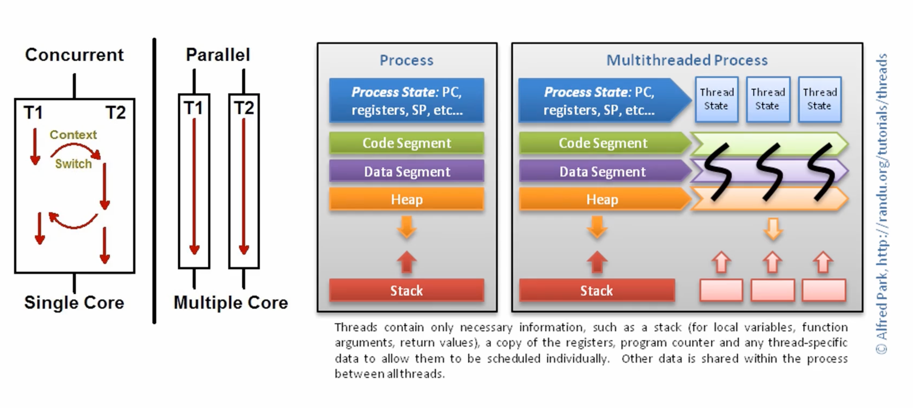
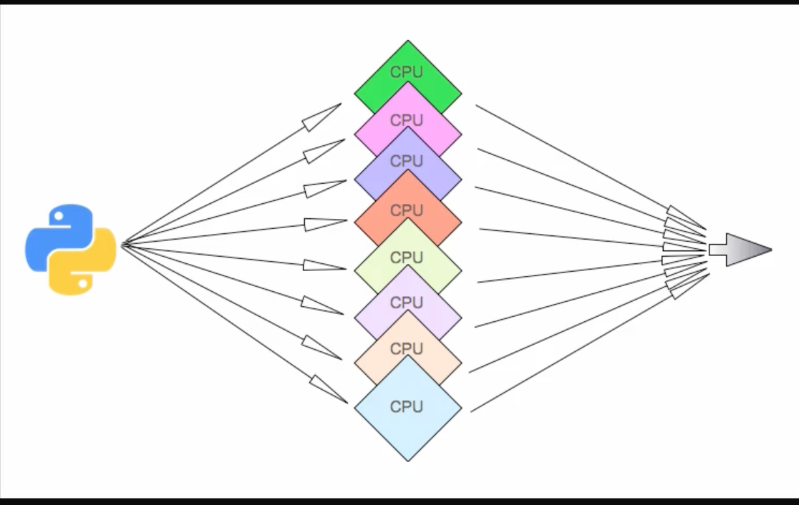

# Parrallelism(병렬성)






### Parrallelism
- 동일한 시점에 태스크 실행 
- 다양한 파트로 나눠서 실행한 뒤, 마지막에 결과물 취합 
- 멀티 프로세싱에서는 1코어일 경우에는 해당 안됨.
- 대체로 딥러닝, 가상화폐 채굴에서 쓰임

### Process Vs Thread(차이 비교(중요))
- 독립된 메모리(프로세스), 공유메모리(스레드)
- 많은 메모리 필요(프로세스), 적은 메모리(스레드)
- 좀비(데드)프로세서 생성 가능성, 좀비(데드)스레드 생성 쉽지 않음
- 오버헤드 큼(프로세스), 오버헤드 작음(스레드)
- 생성/소멸 다소 느림(프로세스), 생성/ 소멸 빠름(스레드)
- 코드 작성 쉬움/디버깅 어려움(프로세스), 코드 작성 어려움/디버깅 어려움(스레드)


### 프로세스 ID랑 이름짓기 실습 

```python
from multiprocessing import Process, current_process
import os
import random
import time


# 실행 방법
def square(n):
    time.sleep(random.randint(1, 3))
    process_id = os.getpid() # 프로세스 id 따오기
    process_name = current_process().name
    result = n * n
    print(f"Process ID: {process_id}, Process Name: {process_name}")
    print(f"Result of {n} square : {result}")


if __name__ == "__main__":
    parent_process_id = os.getpid()
    print(f"Parent process ID {parent_process_id}")

    # 프로세스 리스트  선언
    processes = list()

    # 프로세스 생성 및 실행
    for i in range(1, 11):
        # 생성
        t = Process(name=f"{i}번째 수", target=square, args=(i,))

        # 배열에 담기
        processes.append(t)

        # 시작
        t.start()

    # Join
    for process in processes:
        process.join()

    # 종료
    print("Main-Processing Done!")
```

```zsh
Parent process ID 38875
Process ID: 38879, Process Name: 3번째 수
Result of 3 square : 9
Process ID: 38883, Process Name: 7번째 수
Result of 7 square : 49
Process ID: 38882, Process Name: 6번째 수
Result of 6 square : 36
Process ID: 38877, Process Name: 1번째 수
Result of 1 square : 1
Process ID: 38880, Process Name: 4번째 수
Result of 4 square : 16
Process ID: 38885, Process Name: 9번째 수
Result of 9 square : 81
Process ID: 38881, Process Name: 5번째 수
Result of 5 square : 25
Process ID: 38884, Process Name: 8번째 수
Result of 8 square : 64
Process ID: 38878, Process Name: 2번째 수
Result of 2 square : 4
Process ID: 38886, Process Name: 10번째 수
Result of 10 square : 100
Main-Processing Done!
```


## ProcessPoolExcuter
```python

from concurrent.futures import ProcessPoolExecutor, as_completed
import urllib.request

# 조회 URLS
URLS = ['http://www.daum.net/',
        'http://www.cnn.com/',
        'http://www.naver.com/',
        'http://www.bbc.co.uk/',
        'http://k-digital.goorm.io/']

# 실행 함수
def load_url(url, timeout):
    with urllib.request.urlopen(url, timeout=timeout) as conn:
        return conn.read()

def main():
    # 프로세스풀 Context 영역
    with ProcessPoolExecutor(max_workers=5) as executor:
        # Future 로드(실행X)
        future_to_url = {executor.submit(load_url, url, 60): url for url in URLS}
    
        
        # 실행
        for future in as_completed(future_to_url): # timeout=1(테스트 추천)
            # Key값이 Future 객체
            url = future_to_url[future]
            try:
                # 결과
                data = future.result()
            except Exception as exc:
                # 예외 처리
                print('%r generated an exception: %s' % (url, exc))
            else:
                # 결과 확인
                print('%r page is %d bytes' % (url, len(data)))

# 메인 시작
if __name__ == '__main__':
    main()
```

### 결과 
```
'http://www.bbc.co.uk/' page is 648553 bytes
'http://www.naver.com/' page is 200907 bytes
'http://www.cnn.com/' page is 3305131 bytes
'http://k-digital.goorm.io/' page is 102407 bytes
'http://www.daum.net/' page is 452786 bytes
```

## 프로세스 간 상태 공유하기 

```python
from multiprocessing import Process, current_process, Value, Array
import random
import os

# 실행 함수
def generate_update_number(v : int):
    for i in range(50):
        v.value += 1
    print(current_process().name, "data", v.value)

def main():
    # 부모 프로세스 아이디
    parent_process_id = os.getpid()
    # 출력
    print(f"Parent process ID {parent_process_id}")

    # 프로세스 리스트  선언
    processes = list()

    # 프로세스 메모리 공유 변수
    # from multiprocessing import shared_memory 사용 가능(파이썬 3.8)
    # from multiprocessing import Manager 사용 가능
    
    # share_numbers = Array('i', range(50)) # i, c 등 Flag 확인
    share_value = Value('i', 0)
    for _ in range(1,10):
        # 생성
        p = Process(target=generate_update_number, args=(share_value,))
        # 배열에 담기
        processes.append(p)
        # 실행
        p.start()
        
    # Join
    for p in processes:
        p.join()

    # 최종 프로세스 부모 변수 확인
    print("Final Data(share_value) in parent process",  share_value.value)

if __name__ == '__main__':
    main()
```

```
Parent process ID 47333
Process-7 data 50
Process-6 data 100
Process-2 data 150
Process-1 data 202
Process-4 data 249
Process-3 data 249
Process-5 data 250
Process-8 data 300
Process-9 data 320
Final Data(share_value) in parent process 320
```