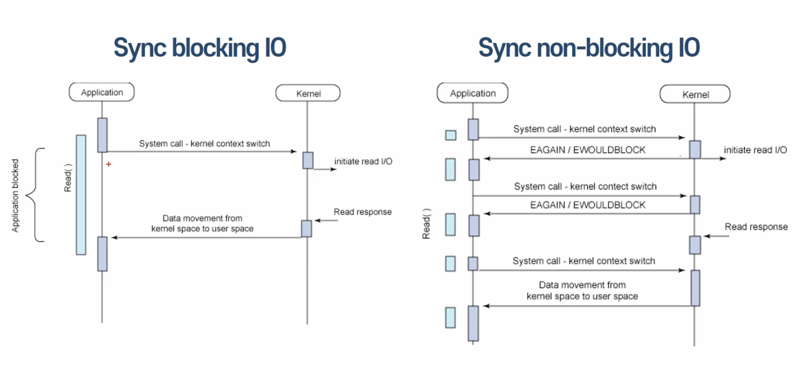

# Concurrency(동시성)

- CPU 가용성 극대화 위해 Parallelism 의 단점 및 어려움을 소프트웨어(구현)레벨에서 해결하기 위한 방법을 의미함.
- 싱글코어 내에서 멀티스레드 패턴으로 작업을 처리함.
- 동시 작업에 있어서 일정양 처리 후 다음 작업으로 넘기는 방식.
- 즉, 제어권을 주고 받으며 작업 처리 패턴, 병렬적은 아니나, 유사한 처리 방식을 띔.

## Concurrency(동시성) vs Parallelism(병렬성) 비교

동시성 : 논리적, 동시 실행 패턴(논리적), 싱글코어, 멀티 코어에서 실행 가능, 한 개의 작업 공유 처리, 디버깅 매우 어려움, Mutex, Deadlock 사용

병렬성 : 물리적, 물리적 동시 실행, 멀티 코어에서 구현 가능, 주로 별개의 작업 처리, 디버깅 어려움, OpenMP, MPI, CUDA 사용

## blocking IO vs Non-blocking

### blocking I/O
- 시스템 콜 요청시 -> 커널 I/O 작업 완료 시 까지 응답 대기
- 제어권 (I/O작업) ->  커널 소유 -> 응답(Response)전 까지 대기(Block) -> 다른 작업 수행 불가(대기)

### Non-blocking I/O
- 시스템 콜 요청시 -> 커널 I/O 작업 완료 여부 상관없이 즉시 응답
- 제어권 (I/O작업) ->  유저 프로세스 전달 -> 다른 작업 수행 가능(지속) -> 주기적 시스템 콜 통해서 I/O 작업 완료 여부 확인

## Async vs Sync

### Async 
- I/O 작업 완료 여부에 대한 Noty는 커널(호출되는 함수) -> 유저프로세스(호출하는 함수)

### Sync 
- I/O 작업 완료 여부에 대한 Noty는 유저프로세스(호출하는 함수) -> 커널(호출되는 함수)

---

## CPU Bound vs I/O Bound

    CPU Bound
    - 프로세스 진행 -> CPU 속도에 의해 제한(결정) -> 행렬 곱, 고속 연산, 압축 파일, 집합 연산 등
    - CPU 연산 위주 작업

    I/O Bound
    - 파일 쓰기, 디스크 작업, 네트워크 통신, 시리얼 포트 송수신, 디스크 작업 -> 작업에 의해서 병목(수행시간)이 결정
    - CPU 성능 지표가 수행시간 단축으로 크게 영향을 끼치지 않음.
    
메모리 바인딩, 캐시 바운딩

작업 목적에 따라서 적절한 동시성 라이브러리 선택이 중요

최종 비교

    - Multiprocessing : Multiple processes, 고가용성(CPU) Utilization -> CPU-Bound -> 10개 부엌, 10명 요리사, 10개 요리

    - Threading : Single(Multi) process, Multiple threads, OS decides task switching. -> Fast I/O-Bound -> 1개 부엌, 10명 요리사, 10개 요리

    - AsyncIO : Single process, single thread, cooperative multitasking, tasks cooperatively decide switching -> Slow I/O-Bound -> 1개 부엌, 1명 요리사, 10개 요리